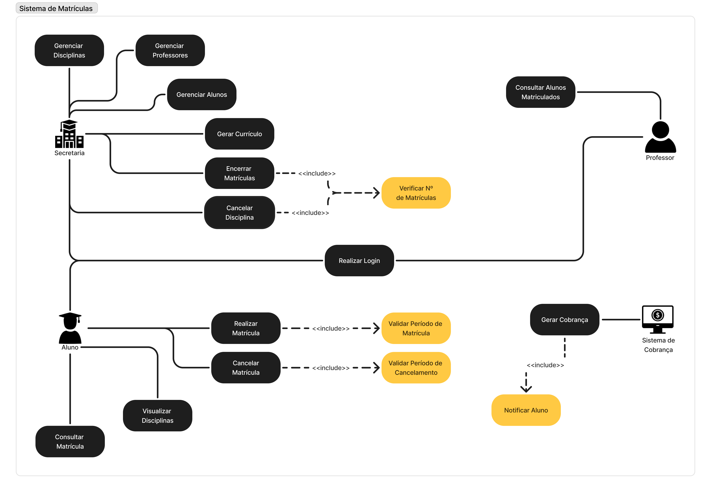

# 📌 Sistema de Matrículas

## 📋 Descrição
Este laboratório consiste no desenvolvimento de um Sistema de Matrículas para uma universidade.
O sistema deve permitir que a secretaria acadêmica gerencie disciplinas, professores e alunos, enquanto os estudantes poderão realizar matrículas e cancelamentos dentro do período estipulado.
Professores terão acesso à lista de alunos matriculados em suas disciplinas.
Além disso, o sistema deve controlar a ativação de disciplinas com base no número mínimo e máximo de alunos inscritos e se integrar ao sistema de cobranças da universidade.
O acesso ao sistema será protegido por login e senha para todos os usuários.

## 🚀 Tecnologias Utilizadas
### Linguagens de Programação

### Frameworks e Bibliotecas

## 📂 Estrutura do Projeto

código
│
├── main
│   ├── java
│   │   ├── app.java
│   │   │    
│   │   ├── controller
│   │   │   ├── ProfessorController.java  
│   │   │   ├── StudentController.java 
│   │   │   ├── AdministrativeStaffController.java  
│   │   │   ├── CourseController.java 
│   │   │   ├── DisciplineController.java  
│   │   │   ├── EnrollmentController.java  
│   │   │   └── PaymentSystemController.java 
│   │   ├── model
│   │   │   ├── abstract
│   │   │   │   └── User.java  
│   │   │   ├── Professor.java  
│   │   │   ├── Student.java  
│   │   │   ├── AdministrativeStaff.java 
│   │   │   ├── Course.java  
│   │   │   ├── Discipline.java  
│   │   │   ├── Enrollment.java  
│   │   │   └── PaymentSystem.java  
│   │   └── service
│   │       ├── ProfessorService.java  
│   │       ├── StudentService.java  
│   │       ├── AdministrativeStaffService.java  
│   │       ├── CourseService.java  
│   │       ├── DisciplineService.java  
│   │       ├── EnrollmentService.java  
│   │       └── PaymentSystemService.java  
│   │

## 📖 Histórias de Usuário
**📌 História de Usuário 01**:
**Como** secretária, **quero** gerar o currículo do semestre, **para que** possa manter as informações organizadas sobre disciplinas, professores e alunos.

**📌História de Usuário 02:**
**Como** aluno, **gostaria** de me inscrever nas matérias obrigatórias e optativas necessárias **para assim** realizar a matrícula.

**📌História de Usuário 03:**
**Como** secretária, **gostaria** de limitar o tempo para gerar e cancelar matrículas **para melhor** organizar o currículo e turmas.

**📌História de Usuário 04:**
**Como** secretária, **gostaria** que ao atingir o limite de 60 pessoas para a disciplina ela fosse encerrada, **para que** assim tenha um limite de turmas.

**📌História de Usuário 05:**
**Como** secretária, **gostaria** que uma turma que tem menos de 3 alunos fosse cancelada, **para que** assim tenha uma gestão melhor de professores.

**📌História de Usuário 06:**
**Como** aluno, **gostaria** de receber a cobrança de a cordo com as matérias que eu me inscrevi, **para assim** efetuar o pagamento e verificar o valor das matérias.

**📌História de Usuário 07:**
**Como** professor, **gostaria** de verificar quais são as turmas que estarei dando aula, **para assim** poder me organizar e localizar.

**📌História de Usuário 08:**
**Como** professor, **gostaria** de verificar quais alunos estão inscritos na minha matéria, **para assim** realizar chamada.

**📌História de Usuário 09:**
**Como** secretária, **gostaria** de verificar quais alunos ja pagaram sua mensalidade, **para assim** organizar o financeiro.

**📌História de Usuário 10:**
**Como** Usuário, eu **gostaria** de gerenciar meu login e autenticação, **para acessar** o sistema com segurança.

## 📊 Diagrama de Casos de Uso

