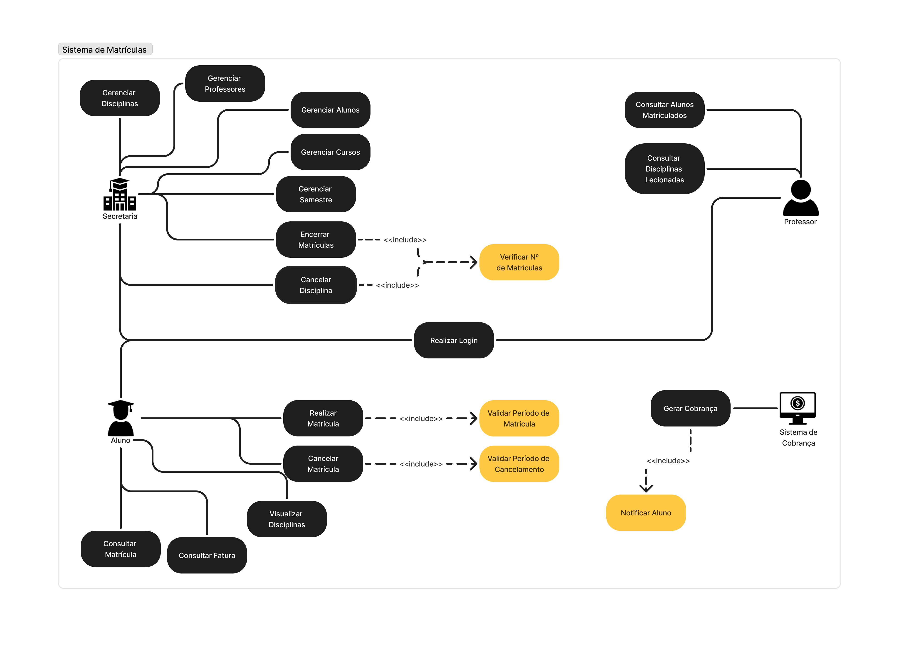

# 📌 Sistema de Matrículas

## 📋 Descrição
Este laboratório consiste no desenvolvimento de um Sistema de Matrículas para uma universidade.
O sistema deve permitir que a secretaria acadêmica gerencie disciplinas, professores e alunos, enquanto os estudantes poderão realizar matrículas e cancelamentos dentro do período estipulado.
Professores terão acesso à lista de alunos matriculados em suas disciplinas.
Além disso, o sistema deve controlar a ativação de disciplinas com base no número mínimo e máximo de alunos inscritos e se integrar ao sistema de cobranças da universidade.
O acesso ao sistema será protegido por login e senha para todos os usuários.

## 🚀 Tecnologias Utilizadas
### Linguagens de Programação

### Frameworks e Bibliotecas

## 📂 Estrutura do Projeto

# Estrutura do Projeto: Sistema de Matrículas
    ├── 📂 Código
    ├── .vscode
    ├── bin
    ├── src
        ├── 📂 controller
        │   ├── AlunoController.java
        │   ├── CursoController.java
        │   ├── DisciplinaController.java
        │   ├── MatriculaController.java
        │   ├── ProfessorController.java
        │   ├── SecretariaController.java
        │   ├── SemestreController.java
        │   ├── SessaoController.java
        │   ├── SistemaCobrancaController.java
        │   ├── UsuarioController.java
        │
        ├── 📂 DAO
        │   ├── AbstractDao.java
        │   ├── AlunoDAO.java
        │   ├── CursoDAO.java
        │   ├── DisciplinaDAO.java
        │   ├── MatriculaDAO.java
        │   ├── ProfessorDAO.java
        │   ├── SecretariaDAO.java
        │   ├── SemestreDAO.java
        │   ├── SistemaCobrancaDAO.java
        │   ├── UsuarioDAO.java
        │
        ├── 📂 models
        │   ├── 📂 abstracts
        │   │   ├── Usuario.java
        │   │
        │   ├── 📂 enums
        │   │   ├── Status.java
        │   │   ├── StatusMatricula.java
        │   │   ├── TipoUsuario.java
        │   │
        │   ├── Aluno.java
        │   ├── Curso.java
        │   ├── Disciplina.java
        │   ├── Matricula.java
        │   ├── Professor.java
        │   ├── Secretaria.java
        │   ├── Semestre.java
        │   ├── SistemaCobranca.java
        │
        ├── 📂 utils
        │   ├── Utils.java
        │
        ├── 📂 views
        │   ├── AlunoView.java
        │   ├── GerenciarAlunosView.java
        │   ├── GerenciarCursosView.java
        │   ├── GerenciarDisciplinasView.java
        │   ├── GerenciarProfessoresView.java
        │   ├── GerenciarSemestreView.java
        │   ├── GerenciarUsuariosView.java
        │   ├── LoginView.java
        │   ├── ProfessorView.java
        │   ├── SecretariaView.java
        │   ├── Main.java
        │
    ├── 📂 data
    ├── 📂 Docs

## 📖 Histórias de Usuário
**📌 História de Usuário 01**:
**Como** secretária, **quero** gerar o currículo do semestre, **para que** possa manter as informações organizadas sobre disciplinas, professores e alunos.

**📌História de Usuário 02:**
**Como** aluno, **gostaria** de me inscrever nas matérias obrigatórias e optativas necessárias **para assim** realizar a matrícula.

**📌História de Usuário 03:**
**Como** secretária, **gostaria** de limitar o tempo para gerar e cancelar matrículas **para melhor** organizar o currículo e turmas.

**📌História de Usuário 04:**
**Como** secretária, **gostaria** que ao atingir o limite de 60 pessoas para a disciplina ela fosse encerrada, **para que** assim tenha um limite de turmas.

**📌História de Usuário 05:**
**Como** secretária, **gostaria** que uma turma que tem menos de 3 alunos fosse cancelada, **para que** assim tenha uma gestão melhor de professores.

**📌História de Usuário 06:**
**Como** aluno, **gostaria** de receber a cobrança de a cordo com as matérias que eu me inscrevi, **para assim** efetuar o pagamento e verificar o valor das matérias.

**📌História de Usuário 07:**
**Como** professor, **gostaria** de verificar quais são as turmas que estarei dando aula, **para assim** poder me organizar e localizar.

**📌História de Usuário 08:**
**Como** professor, **gostaria** de verificar quais alunos estão inscritos na minha matéria, **para assim** realizar chamada.

**📌História de Usuário 09:**
**Como** secretária, **gostaria** de verificar quais alunos ja pagaram sua mensalidade, **para assim** organizar o financeiro.

**📌História de Usuário 10:**
**Como** Usuário, eu **gostaria** de gerenciar meu login e autenticação, **para acessar** o sistema com segurança.

## 📊 Diagrama de Casos de Uso

## 📊 Diagrama de Classes
[**Ver** **PDF**](./Docs/LAB01-Diagrama-de-Classes.png)

