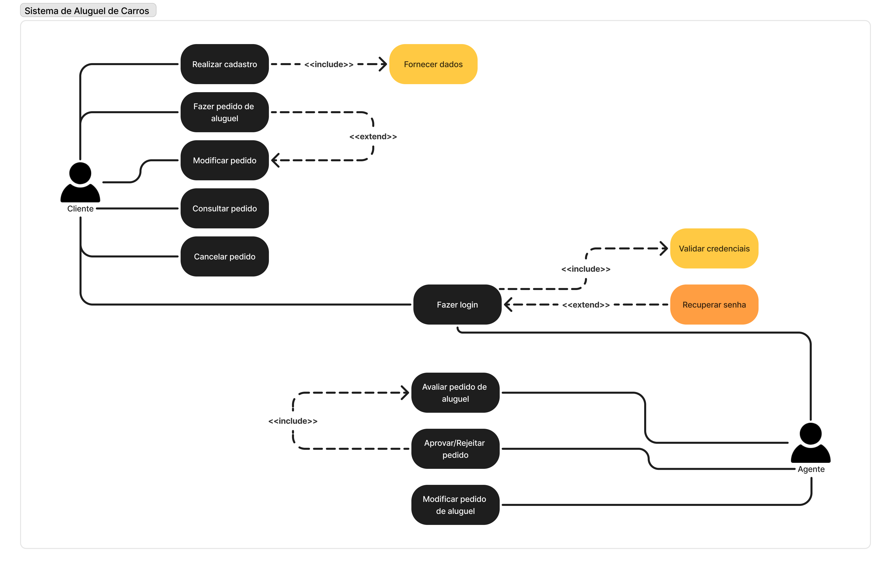
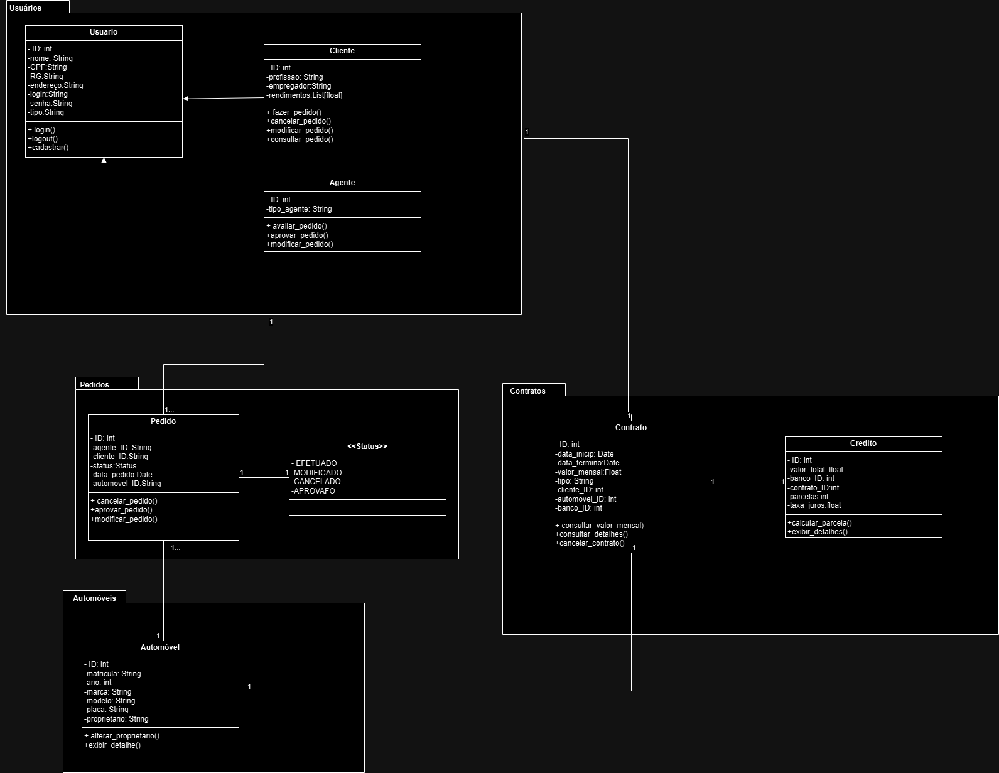
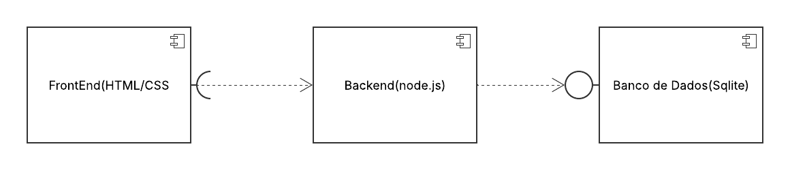
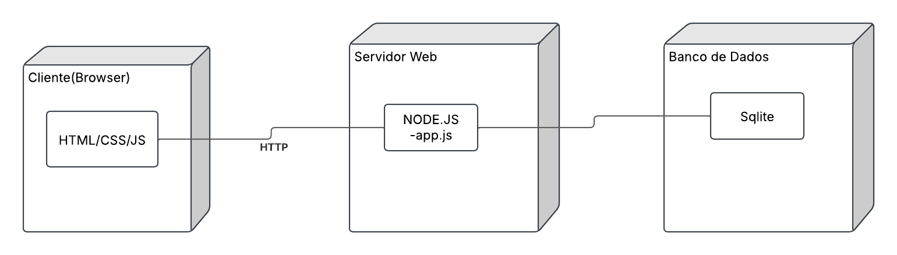

# 🚗 Sistema de Aluguel de Carros  

  

## 📖 Descrição  

O **Sistema de Aluguel de Carros** é um projeto acadêmico desenvolvido para a disciplina de **Laboratório de Desenvolvimento de Software** no curso de **Engenharia de Software**.  

O sistema permite que **clientes** realizem cadastros e gerenciem pedidos de aluguel de automóveis. Além disso, **agentes (empresas e bancos)** podem avaliar e modificar os pedidos. O sistema também integra um fluxo de aprovação financeira antes da confirmação do contrato de aluguel.  

Este projeto utiliza a **arquitetura MVC** e é desenvolvido em **Java com Spring Boot**, seguindo um processo iterativo de desenvolvimento, incluindo modelagem UML e implementação em sprints.  

---

## 🛠️ Tecnologias Utilizadas  

O projeto utiliza as seguintes tecnologias e ferramentas:  

- **Linguagem**: Java  
- **Framework Backend**: Node.js 
- **Padrão Arquitetural**: MVC  
- **Banco de Dados**: JSON   
- **Ferramentas de Versionamento**: Git & GitHub  
- **Documentação**: Markdown & UML  

---

## 🎯 Arquitetura  

O sistema segue a **arquitetura MVC (Model-View-Controller)**:  

- **Model (M)**: Representa os dados e regras de negócio.  
- **View (V)**: Interface com o usuário para entrada e visualização de dados.  
- **Controller (C)**: Camada intermediária que recebe requisições, processa e envia dados para a **View** ou interage com o **Model**.  

A comunicação entre os componentes ocorre através de **REST APIs** e a persistência é feita em um banco de dados .  

---

## 📂 Estrutura do Projeto  
```
📦 sistema-aluguel-carros  
 ├ 📂 docs             
 │ ├     
 │ ├     
 ├ 📂 backend             
 │ ├ 📂 src/main/java/com/aluguelcarros  
 │ │ ├ 📂 controllers    
 │ │ ├ 📂 services       
 │ │ ├ 📂 models        
 │ │ └ 📂 repositories   
 │ ├ 📝 pom.xml           
 │ └ 📝 application.properties 
 ├ 📂 frontend           
 ├ 📂 test               
 ├ 📝 README.md         
 ├ 📝 .gitignore             
```
---

## 📌 Histórias de Usuário  

As seguintes histórias de usuário definem o escopo do sistema:  

### **Cliente**
- ✅ Como cliente, eu quero me cadastrar no sistema, para que eu possa realizar pedidos de aluguel de automóveis.
- ✅ Como cliente, eu quero fazer login no sistema, para que eu possa acessar minha conta e gerenciar meus pedidos de aluguel.
- ✅ Como cliente, eu quero recuperar minha senha, para que eu possa acessar minha conta caso eu a esqueça.
- ✅ Como cliente, eu quero alugar um automóvel, para que eu possa utilizá-lo por um período determinado.
- ✅ Como cliente, eu quero visualizar o status do meu pedido, para que eu possa acompanhar o andamento do processo.
- ✅ Como cliente, eu quero modificar meu pedido, para que eu possa corrigir ou alterar detalhes antes da aprovação.
- ✅ Como cliente, eu quero cancelar um pedido de aluguel, para que eu possa desistir do serviço caso necessário.

### **Agente (Banco/Empresa)**
- ✅ Como agente, eu quero fazer login no sistema, para que eu possa avaliar e aprovar pedidos de aluguel.
- ✅ Como agente, eu quero analisar pedidos de aluguel, para que eu possa decidir se o cliente está apto para alugar um veículo.
- ✅ Como agente, eu quero aprovar ou rejeitar um pedido de aluguel, para que apenas clientes qualificados consigam alugar um veículo.
- ✅ Como agente, eu quero modificar um pedido de aluguel, para que eu possa ajustar valores ou prazos antes da aprovação.

📌 **Para detalhes completos e critérios de aceitação:**  
🔗 [Histórias de Usuário e Critérios de Aceitação](./Docs/historias_de_usuario.md)

---

## 📊 Diagrama de Casos de Uso  

  
📌 **Para detalhes sobre os casos de uso**:  
🔗 [Descrição do Diagrama de Casos de Uso](Docs/casos_de_uso.md)

---

## 📊 Diagrama de Classes  
  

---

## 📊 Diagrama de Pacotes  

  

---

## 📊 Diagrama de Componentes



---

## 📊 Diagrama de Implantação



---

## 🏆 Equipe  

- **Gustavo Delfino** 
- **Júlia Medeiros** 
- **Rafael Caetano** 

---

## 🚀 Como Executar o Projeto  

### 📌 **Pré-requisitos**  
Antes de rodar o projeto, certifique-se de ter instalado:   

### 📌 **Passos para execução**  
